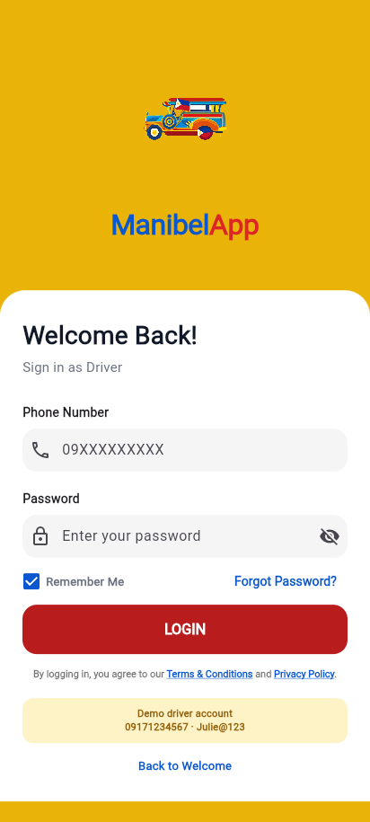
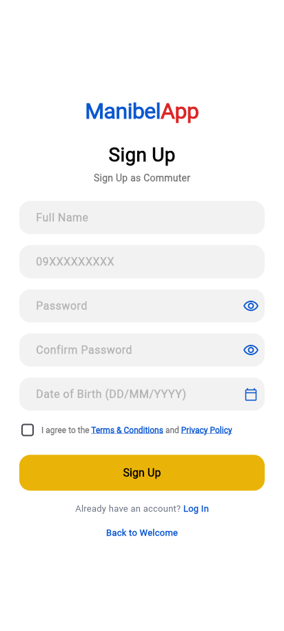

# ManibelApp — Frontend

Flutter app for ManibelApp, a Pasig-Quiapo jeepney commuter and driver app.
Commuters can find and board jeepneys, and drivers manage their trips.

This repo contains only the Flutter frontend (`lib/`). The backend API and
admin website live in separate sibling projects (`backend/` and `admin/`)
referenced from [COMMANDS.md](COMMANDS.md).

## Screenshots

| Role selection | Driver sign in | Commuter sign up |
| --- | --- | --- |
|  |  |  |

## Getting started

```powershell
flutter pub get
flutter run -d windows        # or -d chrome, or a device id from `flutter devices`
```

The app talks to the backend over HTTP (see
`lib/core/services/api_client.dart`); the backend must be running for
sign-in, trip data, etc. to work. See [COMMANDS.md](COMMANDS.md) for the
full setup and day-to-day command reference across the backend, admin
website, and Flutter app.

## Project structure

- `lib/core` — shared constants, services, utils, and widgets
- `lib/features/auth` — sign in / sign up
- `lib/features/commuter` — commuter-facing screens
- `lib/features/driver` — driver-facing screens
- `lib/features/splash` — splash/launch screen
