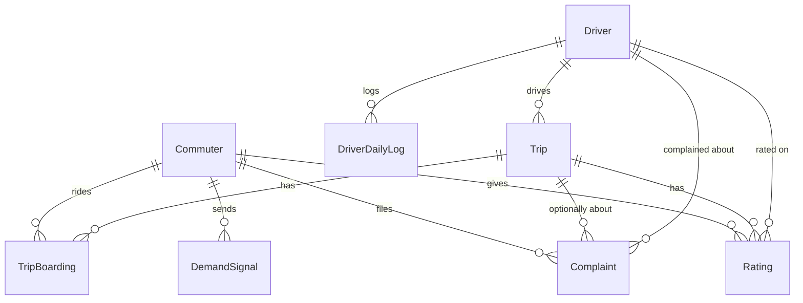

# ManibelApp Database Schema

PostgreSQL, managed with Prisma. Source of truth is
[`prisma/schema.prisma`](prisma/schema.prisma) — this file is a readable
companion to it, current as of 2026-08-18. Regenerate/update it by hand
whenever the schema changes materially; it isn't auto-generated.

## Overview

Three account types (`Commuter`, `Driver`, `Admin`) are separate tables,
not a shared `User` table with a role column — each logs in differently
(commuter/driver by PH mobile number, admin by email) and has its own
fields. Relationships between tables (`Trip.driverId`, `Complaint.tripId`,
etc.) are plain string columns, **not** Prisma `@relation` foreign keys —
the app joins them at the application layer instead of relying on DB-level
referential integrity or cascades.

## Entity relationship

## Core account tables

### `Commuter`
Rider account. Logs in with `mobileNumber` (E.164 `+63XXXXXXXXXX`) + password.

| Field | Type | Notes |
|---|---|---|
| `commuterId` | String, unique | Display id, e.g. `CM-00001` |
| `mobileNumber` | String, unique | |
| `passwordHash` | String | bcrypt |
| `photoUrl` | String? | `/uploads/profile-photos/...` |
| `phoneVerifiedAt` | DateTime? | Set once signup OTP is verified |
| `dateOfBirth` | Date? | Collected at signup itself now (not a later step); **admin-only to edit afterward** — the commuter's own `PATCH /me` no longer accepts it, only `PATCH /admin/commuters/:id/date-of-birth` does |
| `idType`, `idFrontUrl`, `idBackUrl`, `selfieUrl` | String? | KYC docs captured at signup |
| `verificationStatus` | `IdVerificationStatus?` | null → PENDING → APPROVED/REJECTED, admin-reviewed only |
| `isActive` | Boolean | Login gate — false until admin approves |

### `Driver`
Logs in the same way as `Commuter`, but accounts are **admin-created**, not
self-registered — there's no driver signup flow with review.

| Field | Type | Notes |
|---|---|---|
| `driverId` | String, unique | e.g. `DR-00001` |
| `plateNumber` | String | |
| `dateOfBirth` | Date? | Optional at Add Driver; **admin-only to edit** afterward, same as `Commuter.dateOfBirth` |
| `licenseFrontUrl`, `licenseBackUrl` | String? | Submitted by the **driver themselves** (Settings → License Number → upload both → submit) — no admin-side photo upload exists anymore |
| `licenseNumber` | String? | Always admin-entered — either recorded directly (Add Driver, or a later correction) or typed in while reviewing a submitted photo. Never OCR'd |
| `licenseVerificationStatus` | `IdVerificationStatus?` | null → PENDING (photos submitted) → APPROVED/REJECTED (admin review). **Gates `POST /driver/trips/start`** — a driver can't start a trip until this is APPROVED |
| `qrToken` | String?, unique | Permanent, backend-verified — encoded into the driver's QR |
| `isActive` | Boolean | default `true` (opposite default from Commuter) |

### `Admin`
Operator/staff account for the web dashboard. Email+password login,
created via CLI (`create-admin.ts`) or by the Main Admin in-app — no
self-registration.

| Field | Type | Notes |
|---|---|---|
| `role` | `AdminRole` | `MAIN_ADMIN` \| `ADMIN` |
| `isActive` | Boolean | Main Admin can never be deactivated (app-enforced) |
| `lastLoginAt` | DateTime? | |

**DB constraint (raw SQL, not expressible in Prisma's schema DSL):**
exactly one `MAIN_ADMIN` row is enforced by a partial unique index —
`CREATE UNIQUE INDEX "Admin_single_main_admin" ON "Admin" ("role") WHERE "role" = 'MAIN_ADMIN'`.

### `PendingCommuterSignup`
Staging row for a commuter mid-signup (phone verified, ID/selfie upload
in progress) — no `Commuter` row exists yet. Redeemed by ticket into a
real `Commuter` once complete; has its own `expiresAt` separate from the
OTP's. Holds `dateOfBirth` too now — collected on the signup form itself
and carried over to the `Commuter` row on redemption.

## Trips & rides

### `Trip`
One jeepney run: `Start Trip` → `End Trip`. No passenger manifest is
tracked here — `TripBoarding` is the per-rider record.

| Field | Type | Notes |
|---|---|---|
| `status` | `TripStatus` | `ACTIVE` \| `COMPLETED` |
| `currentLat`/`currentLng`/`locationUpdatedAt` | | Overwritten in place on each location ping — no ping-history table, just "where is it right now" |
| `isShortTrip` | Boolean | Auto-flagged if trip duration < 60s (likely an accidental tap, not a real ride) |
| `flagReason` | String? | Backend-generated explanation |
| `driverExplanation` / `explanationSubmittedAt` | | Driver's own account of a flagged trip |
| `reviewStatus` | `TripReviewStatus` | `PENDING` → `REVIEWED` / `VALID` / `INVALID`, admin-set |
| `reviewedAt` / `reviewedBy` / `adminReviewNote` | | Admin review trail |

Indexes are shaped around Trip History's dominant query (`driverId` +
optional `status` + `startedAt`-ordered), plus a **partial index** (raw
SQL) for the live map's "most recently located trip per driver":
`CREATE INDEX "Trip_driverId_startedAt_located_idx" ON "Trip"("driverId", "startedAt" DESC) WHERE "currentLat" IS NOT NULL`.

### `TripBoarding`
One row per **ride segment** — a commuter's board→alight on one `Trip`.
Since a driver's `Trip` commonly spans a whole shift, the same commuter
can honestly board and alight the same `Trip` more than once in a day
(rode out, rode back); each segment gets its own row rather than being
collapsed.

| Field | Type | Notes |
|---|---|---|
| `boardedAt` / `alightedAt` | DateTime / DateTime? | Open (still riding) when `alightedAt` is null |
| `regularRiders`, `studentRiders`, `seniorRiders`, `fare` | Int?/Float? | Party size + computed flat fare at boarding time |

**DB constraint (raw SQL):** not a plain `@@unique([tripId, commuterId])`
(that would cap a commuter to one ride ever per Trip) — instead a
**partial unique index** allows unlimited *closed* rows but at most one
*open* one per (trip, commuter):
`CREATE UNIQUE INDEX "TripBoarding_tripId_commuterId_open_key" ON "TripBoarding"("tripId", "commuterId") WHERE "alightedAt" IS NULL`.

### `Rating`
One 1–5 star rating per commuter per trip (`@@unique([tripId, commuterId])`
in schema — a real DB constraint here, unlike most other relations).
Driver averages are computed on read, not denormalized.

### `DemandSignal`
Anonymous "I want a ride here" ping from the live map — deliberately
never joined back to commuter identity in any API response; both admin
and driver endpoints only ever return clustered grid cells.

| Field | Type | Notes |
|---|---|---|
| `lat`/`lng` | Float | |
| `route` | String? | Lets a driver's endpoint filter to just their own route |
| `fulfilledAt` | DateTime? | Set on boarding or explicit cancel; null = still waiting. Row is kept either way (counts toward daily stats), just stops surfacing |

At most one *unfulfilled* signal is kept per commuter (refreshed in
place, not duplicated) — enforced at the application layer, not the DB.

## Complaints & DailyLog

### `Complaint`
Commuter-filed complaint against a driver, resolved from a plate number
to a `Driver` id at submission time. `tripId` is optional — only set
when filed from a specific Trip History entry.

`status`: `PENDING` → `INVESTIGATING` → `RESOLVED` / `REJECTED`.

### `DriverDailyLog`
Driver's once-a-day self-reported earnings/odometer/expenses (jeepney
fares are cash — there's no payment system to source this from
automatically). One row per driver per day (`@@unique([driverId, date])`,
upserted). Trip *counts* for Analytics/Reports come from `Trip` instead;
only the money/odometer figures come from here.

## Notifications

Split into **one table per recipient type** (`DriverNotification`,
`CommuterNotification`, `AdminNotification`) rather than a single
polymorphic table with a `recipientType` discriminator — each
recipient's app only ever queries its own table.

| Field | Type | Notes |
|---|---|---|
| `recipientId` | String | Driver/Commuter tables only — `AdminNotification` has none, it broadcasts to the whole admin team |
| `title` / `message` | String | |
| `isRead` | Boolean | Per-admin notifications share one flag for the whole team, not per-admin |
| `type` / `referenceId` | String? | Makes a notification tappable, e.g. type `TRIP_SHORT_FLAGGED` + a Trip id |

## Auth support

### `OtpCode`
Used for signup verification, password reset, and phone-number change,
across all three account types (`purpose: OtpPurpose`). 5-minute expiry,
single-use (`consumed`). Currently logged to the server console rather
than sent via a real SMS gateway — see the backend README/pre-release
notes.

## Enums

| Enum | Values |
|---|---|
| `OtpPurpose` | `PASSWORD_RESET`, `SIGNUP_VERIFICATION`, `PHONE_CHANGE` |
| `IdVerificationStatus` | `PENDING`, `APPROVED`, `REJECTED` |
| `TripStatus` | `ACTIVE`, `COMPLETED` |
| `TripReviewStatus` | `PENDING`, `REVIEWED`, `VALID`, `INVALID` |
| `ComplaintStatus` | `PENDING`, `INVESTIGATING`, `RESOLVED`, `REJECTED` |
| `AdminRole` | `MAIN_ADMIN`, `ADMIN` |

## Things worth knowing before changing this schema

- **No `@relation`/foreign keys.** Deleting a `Driver` or `Commuter` row
  does not cascade — `Trip`, `TripBoarding`, `Complaint`, etc. rows
  referencing it are simply orphaned (a plain string no longer resolving
  to anything), not blocked or auto-deleted. Any future FK-based rewrite
  is a real migration, not a config toggle.
- **Partial unique indexes** (`Admin` single-main-admin, `TripBoarding`
  single-open-boarding) and the `Trip` located-only partial index all
  live in hand-written SQL under `prisma/migrations/`, not in
  `schema.prisma` — Prisma's schema DSL can't express a `WHERE` clause on
  an index. Keep this in mind when reading the schema file alone; it
  under-states the actual constraints.
- **Uploads are local disk** (`backend/uploads/`, gitignored), referenced
  by relative URL strings (`/uploads/id-photos/xyz.jpg`) — not a blob
  column and not S3. Flagged as a pre-release scaling concern.
- **`dateOfBirth` is admin-only to edit** for both `Commuter` and
  `Driver` — neither self-service `PATCH /me` endpoint accepts it
  anymore; only `PATCH /admin/{commuters,drivers}/:id/date-of-birth`
  does. The app's own Settings screens show it read-only.
- **`PATCH /admin/drivers/:id/license-number` is dual-purpose** —
  whether `status` is in the request body decides which of two unrelated
  things happens: omit it for a plain correction (just updates
  `licenseNumber`, no photo required), include it (`APPROVED`/
  `REJECTED`) to review a submitted photo (sets `licenseNumber` +
  `licenseVerificationStatus` together, requires `licenseFrontUrl` to
  exist). Easy to miss reading the route alone — check the request body.
